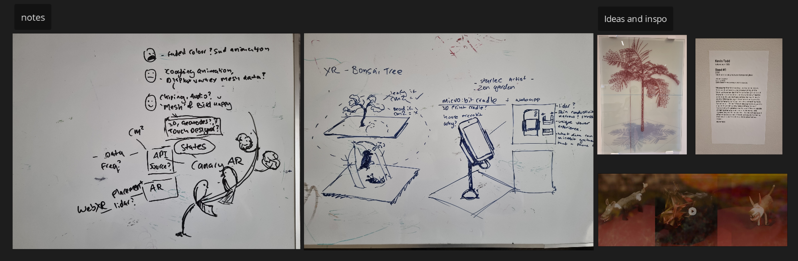
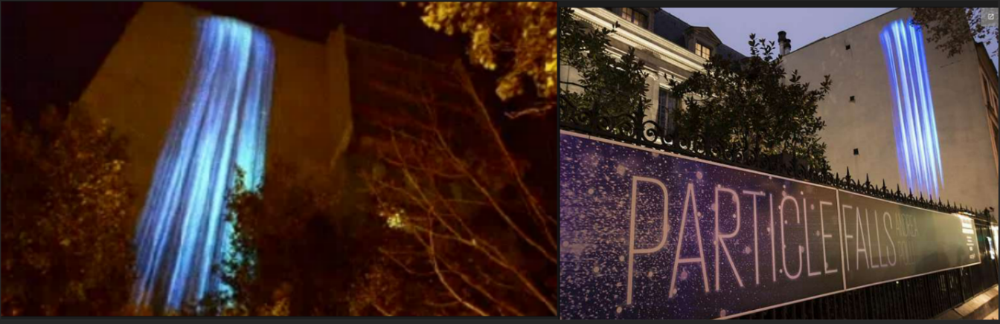
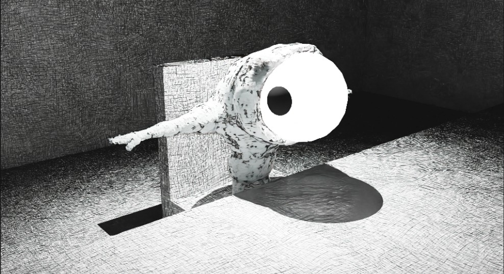
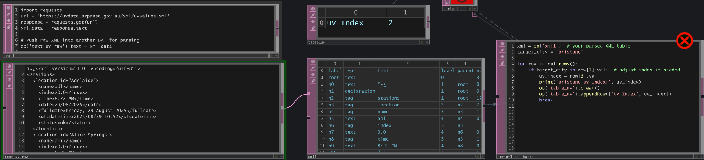

# Name: Matthew Bissell
# Student Number: 
# Group:

# ENTRY 1 · 06-08-2025 

## Subheader
Ideation and brainstorming on the task brief for potential responsive and contextual devices or wearables. Fast and loose ideation led to looking mostly at augmented reality and how GLTF data could be used with webXR to show 'unseen' data.

Reference: Seed #1 year 2000. Kevin TODD Inkjet print on vinyl. Potraying a very mathmatical representation of a tree, early idea around a 'living object' that isn't real, reacting to unseen data that the user 'would' feel.

## Early concept - 

Virtual Canary

- WebXR concept: morphing a 3D canary model based on air quality data pulled from a rest API (a nod to “canary in a coal mine”). 
- GLTF pipeline: Could geometry respond to phone tilt or ambient sensors? 
- Outputs: Visual overlays first; audio as a possible extension. 
- Scalability: Solo = minimal viable pipeline; group = richer sensor inputs and multi-user features. 

# ENTRY 2 · 18-08-2025

## Inspiration

### Polli, A. (n.d.). Particle Falls. Andrea Polli. https://www.andreapolli.com 

I came across Andrea Polli’s Particle Falls, a live particle projection driven by air-quality data. Watching how she visualised PM2.5 values into shifting visuals made me wonder if TouchDesigner could power a users own video feed on mobile, while having a contextually unique visualisation to said user(s)

Weird little guy

Initial steps were to brainstorm an idea, that  I could pitch to canvas in the hopes of attracting group members. I was drawn to various artworks that displayed and contextulised data - such as 'waterfall that changes based on air quality from rest API's. 

[waterfall image]

This led me down the patch of experimenting with touch designer - often used in VJ'ing it offered the ability to 

- stream realtime video
- call a rest api
- modulate the particle effect in a clear and understandable manner
- stream it back relatively fast back into a website

Augmented reality, canary warning system. User looks through phone camera, 3D canary would change based on air quality (states - 
- happy model upright twittering air quality good
- canary coughing sad or different twittering?

# Touch Designer

Before moving forward with the idea I needed to investigate how TD can call API's - with the help of AI I was able to create some Texture Operators that called a UV index API and map it to a table.

AI helped by writing some python code that loops through the table looking for a uv-index on 'row' 3, output that value to a seperate table. Theoritically should allow me to map data.

# liDAR Point clouds

I had been interested in point clouds and using a lidar camera to map those points in 3D space, virtualising the current environment, this was appealing because touchdesigner is able to generate and manipulate these points very fast.

- obtaining lidar scan was possible but far too intensive to get working. a kinect camera seemed like a great subsitute, but would deligate any tech to be an installation. I wanted the project to be mobile friendly and not an art installation.

Initial experiments involved attempting to map these clouds using footage and attempting to map depth based on luminance data. 

[Image of weird point cloud]

This did not work, however it did spawn ideas around using video in of a camera, and using some of the same principles to map sections. Aswell as tutorials on mapping camera motion different effects, calculating motion vectors, tops, chops and all that good stuff.

# Blocks

When reviewing course materials for Week 8 - I was stunned by Rozins Mirror, although I knew I could never approach anything that complex but the mosiac of 'ASCII' art effects (expand on this as to why)

Using motion t

# skin cancer

After reviewing course material for week 7 - I was really impressed by Rozins Mirror. 

When approaching what data to map I was a bit stumped. I kept coming back to the idea of UV and a UV index. 

# feedback

Before pitching my concept I emailed Michael Norris for feedback around the concept in preparation for Week 7, I wanted to have the skeleton of the project there 

Email Michael Norris

I’m currently exploring a concept for a context-aware web app that captures live video from a user’s phone along with their location. This data would be piped into TouchDesigner via a local server (possibly using WebSockets), where it undergoes fast, interactive image treatment. The processed visuals would then be streamed back to the web app in real time.
The core idea is to visualise unseen environmental data. For example, I’m looking at using a REST API to fetch the current UV index (from ARPANSA’s XML feed) and, by referencing the phone’s geolocation, apply that data to distort or colour-grade the live camera feed.

He was able to provide valuable feedback in which I agreed. Make the effect obvious to the user so as to give it purpose. With this in mind I started to explore a possible wireframe in figma to show how the web app would would look.

# padlet pitch

I pitched to padlet but no one seemed interested in joining in on the project. To garner interest I did go down the path of creating a mockup of the

